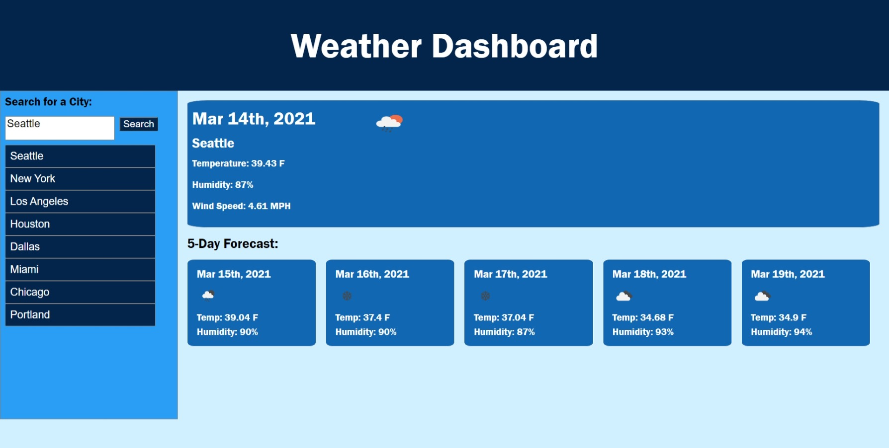

# weather_app

## Description

This is a basic weather app that will give you the tempature, humidity and wind speeds of any city, with easy to see icons displaying the weather. It will also give a 5 day forecast using the Open Weather Map API

## Usage

<!-- screenshot of webpage -->

Link to deployed webpage
<!-- link to webpage -->

Click the link to deploy the application
<https://sosoberg.github.io/weather_app/>

## Sources

